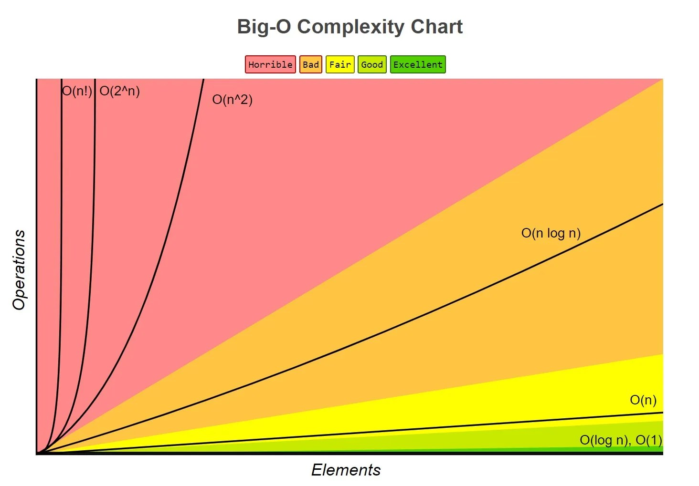

# Javascript Algorithms



### Javascript object of Big-O
```javascript
const person = {
    firstName: 'John',
    lastName: 'Doe'
}
```
Time Complexity is O(1) for all below operations
- Insert
- Remove
- Access
- Search

Time Complexity is O(n) for all below operations
- Object.keys
- Object.values
- Object.entries

### Array of Big-O
```javascript
const odd = [1, 3, 5, 7, 9]
```
Time Complexity is O(1) for all below operations
- Insert/remove at end
- Access
- Push/pop

Time Complexity is O(n) for all below operations
- Insert/remove and the beginning
- Search
- Shift/unshift/concat/slice/slice/splice
- forEach/map/filter/reduce

** calculation not dependent on input size - O(1)
- loop - O(n)
- nested loop - O(n^2)
- Input size reduced by half - O(log n)